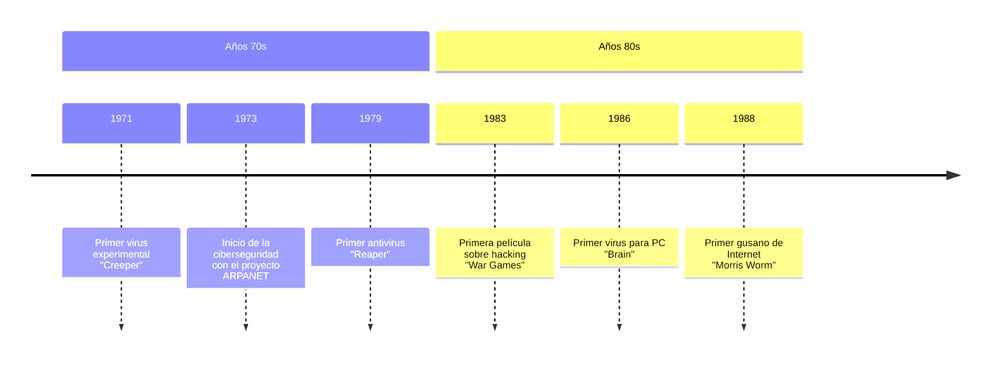
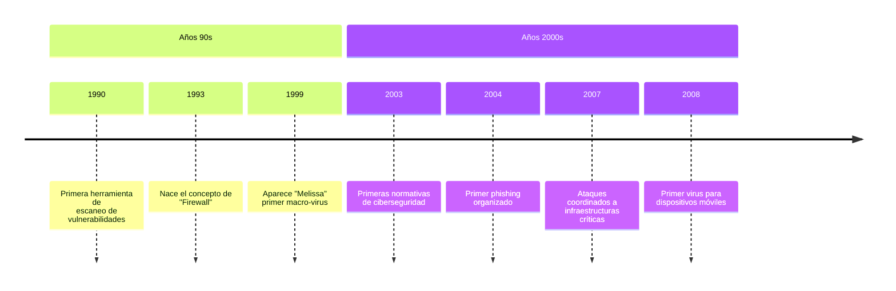
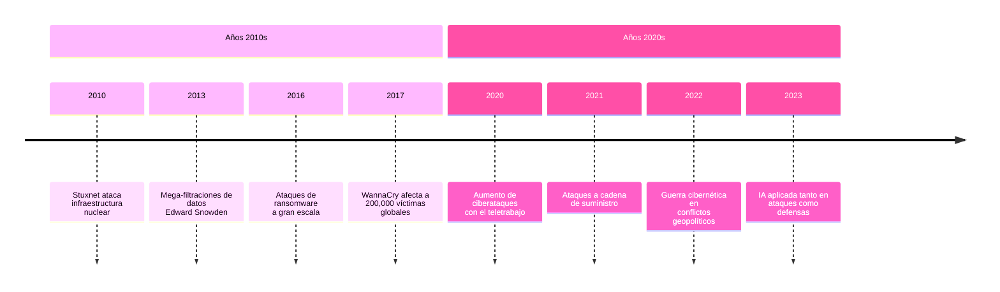

# 307ssa
 

### Seguridad en Servicios y Aplicaciones (服务和应用程序的安全性)

### Actividad#1

#### Tema 1: "Fundamentos de la seguridad. Criptografía y sus servicios."

#### Conferencia 1: "Introducción a la seguridad. Criptografía y servicios"
---

#### Introducción

> La seguridad informática y la  criptografía constituyen dos pilares fundamentales en la protección de  la información dentro del entorno digital actual. La primera se encarga  de establecer marcos, políticas y procedimientos para resguardar los  sistemas, redes y datos contra accesos no autorizados, alteraciones o  destrucción malintencionada. Su objetivo principal se sustenta en tres  principios esenciales: confidencialidad, que garantiza que la  información solo sea accesible para quienes estén autorizados;  integridad, que vela por la exactitud y completitud de los datos a lo  largo de su ciclo de vida; y disponibilidad, que asegura que los  recursos informáticos estén operativos cuando se necesiten.
>
> Por su parte, la criptografía actúa como el conjunto de herramientas  técnicas y matemáticas que hacen posible materializar estos principios.  Esta disciplina, que ha evolucionado desde métodos ancestrales hasta  soluciones avanzadas basadas en algoritmos complejos, permite  transformar información legible en texto cifrado mediante procesos de  cifrado, y recuperarla mediante el descifrado correspondiente. Además,  la criptografía ofrece mecanismos robustos para autenticar identidades,  verificar la integridad de los datos y asegurar el no repudio de las  transacciones electrónicas.
>
> La relación entre seguridad informática y criptografía es intrínseca y  complementaria. Mientras la seguridad establece los marcos globales de  protección y gestión de riesgos, la criptografía proporciona los métodos técnicos para implementar dichas defensas de manera efectiva. Juntas,  permiten el desarrollo de comunicaciones seguras a través de canales no  confiables, el almacenamiento protegido de información sensible, la  realización de transacciones electrónicas con garantías de autenticidad y la gestión de identidades digitales confiables. En un mundo cada vez  más interconectado y dependiente de los datos, el dominio de ambos  campos se ha vuelto indispensable para cualquier organización o  profesional que busque salvaguardar sus activos información en el  ciberespacio.

##### Un poco de historia

#### Objetivo

> Caracterizar los conceptos y principios básicos de la seguridad informática así como las amenazas, ataques, vulnerabilidades sobre las redes e implicaciones de la criptografia en la seguridad.  

#### Bibliografía

"Security in Computing" - PFLEEGER, C. P.; PFLEEGER, S. L.; MARGULIES, Jonathan. (4th edition)

#### Reflexión inicial

> "El único sistema seguro es aquel que: está apagado y desconectado, enterrado en un refugio de cemento, rodeado por gas venenoso y custodiado por guardianes bien pagados y muy bien armados. Aún así, yo no apostaría mi vida por él."
> 
> *- Gene Spafford, Cyber Security Hall of Fame 2013*

**Pregunta reflexiva**: ¿Tendrá alguna relación el desarrollo de la seguridad informática con el desarrollo de las técnicas de ataques a sistemas computarizados?

#### Motivos de los ataques informáticos

| Dinero | Accesos a recursos limitados | Competencia | Conflictos personales |
|--------|-----------------------------|-------------|----------------------|

#### Impacto negativo en la sociedad

- Grandes empresas en quiebra
- Pérdida de identidad de las personas
- Robo de propiedad intelectual
- Pérdida de información
- Interrupción de servicios básicos (agua, electricidad)

#### Conceptos y principios de la Seguridad Informática

#### Seguridad informática

Conjunto de métodos y herramientas destinados a preservar la integridad, disponibilidad y confidencialidad de los bienes informáticos de una institución.

#### Pilares de la Seguridad Informática

| Confidencialidad | Integridad | Disponibilidad |
|------------------|------------|----------------|

#### Principios de la Seguridad Informática

1. **Proporcionalidad**: Las medidas de seguridad deben estar en correspondencia con lo que se protege y con el nivel de riesgo existente.

2. **Dinamismo**: La seguridad informática no es un producto, es un proceso.

3. **Mínimo privilegio**: Se deben otorgar los permisos estrictamente necesarios para efectuar las acciones que se requieran, ni más ni menos de lo solicitado.

4. **Eslabón más débil**: La seguridad de un sistema es tan fuerte como su parte más débil.

5. **Participación universal**: La gestión de la seguridad informática necesita de la participación de todo el personal de una institución.

#### Conceptos fundamentales

- **Vulnerabilidad**: Debilidad en el sistema de seguridad.
- **Amenaza**: Grupo de circunstancias que tienen el potencial para causar algún daño o pérdida.
- **Ataque**: Explotar una vulnerabilidad. Se estaría realizando un ataque contra un sistema.
- **Riesgo**: Es la probabilidad de ocurrencia de una amenaza en el entorno.
- **Impacto**: Es el nivel de afectación de un incidente de seguridad en el sistema.

#### Tipos de ataques

##### Ataques pasivos

El atacante no altera la comunicación, únicamente la escucha o monitorea, para obtener la información que está siendo transmitida. Sus objetivos son la intercepción de datos, acceder a la información y el análisis de tráfico.

##### Ataques activos

Estos ataques implican algún tipo de modificación del flujo de datos transmitido o la creación de un falso flujo de datos.

#### Clasificación de las amenazas

| Intercepción | Modificación |
|--------------|--------------|
| Interrupción | Fabricación  |

##### Intercepción

Acceso a la información por personas no autorizadas. Es un ataque de tipo pasivo contra la confidencialidad de la información.

- **Tipo de ataque**: Pasivo
- **Pilar que afecta**: Confidencialidad

##### Modificación

Acceso no autorizado a la información en el que se produce una modificación de la misma.

- **Tipo de ataque**: Activo
- **Pilar que afecta**: Integridad

##### Interrupción

Deja de funcionar total o parcialmente un sistema informático.

- **Tipo de ataque**: Activo
- **Pilar que afecta**: Disponibilidad

##### Fabricación

Se crean objetos falsificados en un sistema de cómputo. El intruso puede insertar operaciones no esenciales de un sistema de comunicación de red.

- **Tipo de ataque**: Activo
- **Pilar que afecta**: Integridad

**Ejemplo**: Añadir registros a un archivo o a una base de datos existente.

#### Técnicas de ataque

#### Footprinting

El uso de herramientas y de la información para crear un perfil completo de la postura de la seguridad de una organización.

##### Scanning

El atacante usa herramientas y la información obtenida para determinar qué sistemas están accesibles desde Internet así como qué puertos están escuchando en el sistema.

##### Enumeration

Uso de herramientas para obtener la información detallada (servicios ejecutándose, cuentas de usuario, miembros de un dominio, políticas de cuentas, etc.) sobre un sistema remoto, con el intento de atacar la seguridad de cuentas y servicios.

##### Ingeniería social

Es la manipulación de las personas para convencerlas de que ejecuten acciones o actos que revelan todo lo necesario para superar las barreras de seguridad.

Parte de la base que el factor humano es el eslabón más débil de la seguridad. Si el atacante tiene la experiencia suficiente puede engañar fácilmente a un usuario que desconoce las mínimas medidas de seguridad.

Esta técnica es una de las más usadas y efectivas a la hora de averiguar nombres de usuarios y contraseña.

#### Tipos de ataques específicos

##### Monitorización

Se realizan para observar a la víctima y su sistema con el objetivo de establecer sus vulnerabilidades y posibles formas de acceso futuro. Entre estos ataques tenemos el "Shoulder Surfing", los "Decoy" o Señuelos, el "Phishing" y el "Scanning" o Búsqueda el cual a su vez tiene varias clasificaciones.

##### Phishing

Se caracteriza por la adquisición de información confidencial de forma fraudulenta, como puede ser una contraseña o información detallada sobre tarjetas de crédito u otra información bancaria.

##### Ataques de Autenticación

Tienen como objetivo engañar al sistema de la víctima para ingresar al mismo, a partir de sesiones ya establecidas por la víctima u obteniendo cuentas de usuarios y contraseñas.

Entre estos ataques encontramos los "Spoofing" y todas sus clasificaciones, "IP Splicing-Hijacking".

##### IP Spoofing

Este tipo de ataque enmascara el origen del atacante. El objetivo de este ataque es la suplantación de identidad, en este caso la suplantación de la dirección IP. Consiste en generar paquetes de información, con una dirección IP falsa en el encabezado de los paquetes IP. Si ocurre un ataque la persona culpada será otra y no el intruso.

##### Denegación de servicio (DoS)

Este tipo de ataque lo que pretende es saturar los recursos de la víctima con el propósito de inhabilitar los servicios brindados por el mismo.

El atacante puede consumir toda la memoria o espacio en disco disponible, así como enviar tanto tráfico a la red de forma tal que esta quede inutilizada.

**Tipos de ataques DoS**

- **Smurf o broadcast storm**: Este ataque consiste en mandar una petición ICMP a una dirección difusión, la cual llevará como dirección IP de origen, la del que se desea atacar. Esta solicitud llegará a todas las máquinas de la red y todas simultáneamente responderán a la computadora víctima, saturándola de respuestas que no puede procesar y produciendo un colapso en su sistema.

- **Flooding**: Se satura la pc víctima de mensajes que requieren establecer conexión y dar respuesta. Como la dirección IP del mensaje puede ser falsa, empleando la técnica Spoofing, la pc atacada intenta dar respuesta a la solicitud de cada mensaje, saturando su buffer con información de conexiones abiertas en espera de respuestas.

#### Mecanismos de defensa

- **Prevención**: Aumentar la seguridad del sistema, previniendo la ocurrencia de violaciones a la seguridad.
- **Detección**: Detectar la ocurrencia de una violación a la seguridad en el momento en que se produce la misma.
- **Recuperación**: Retornar el sistema a su normal funcionamiento después de una violación.
